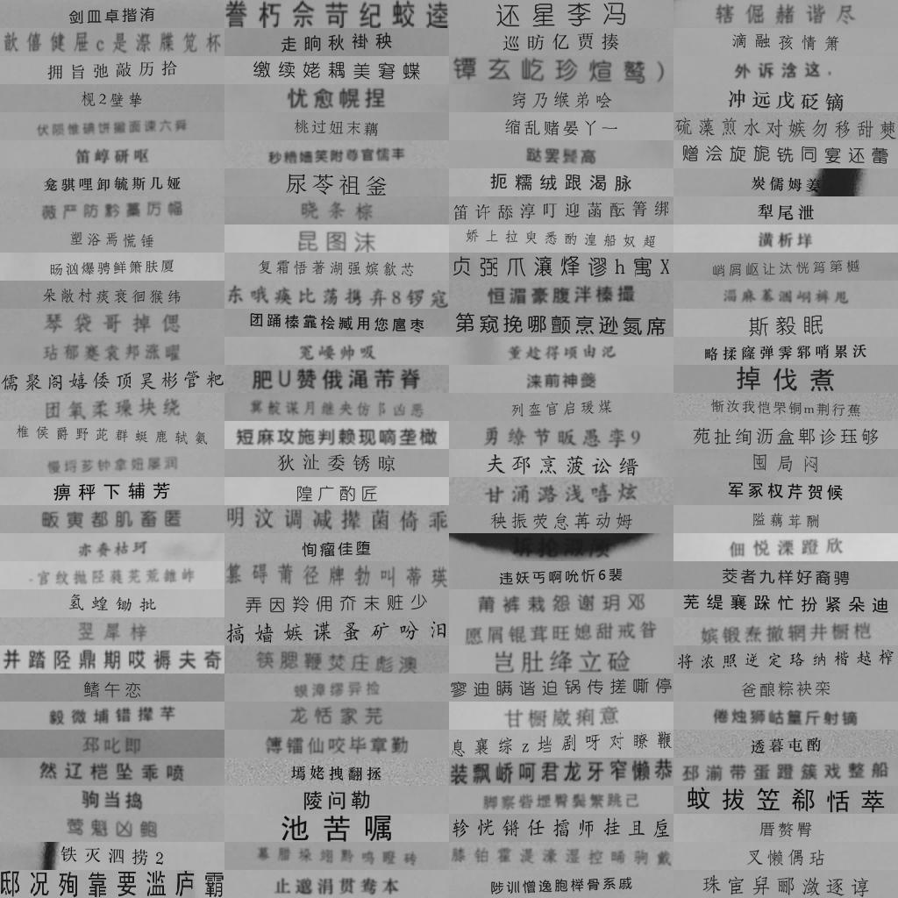

# 中文OCR合成数据集

本数据集使用**手机拍摄的纸张,桌面,墙面等作为背景.包含汉字,字母大小写,数字和几个标点符号共4702个字符,其中汉字除了一级和二级字库,还有快递地址和人名常用的字符**, 使用多种增强方式,如模糊,扭曲,旋转,噪声等.主要用于训练识别手机拍摄的各种印刷单据文字的模型.

- 数据集[下载地址[ code: nbab ] (MD5: 32a4813e793cfe7aced029bb46674f70)](https://pan.baidu.com/s/1EqFie248zUWkvqhNtCUsvg).
- 在该数据集上训练的一个demo模型 (todo)

## 一些例子

## 引用

如果此数据集对您的研究/项目有帮助,请引用[该项目](https://github.com/opconty/synthetic_Chinese_OCR_dataset).
If you use our dataset in your research/project, please consider citing [this project](https://github.com/opconty/synthetic_Chinese_OCR_dataset).
